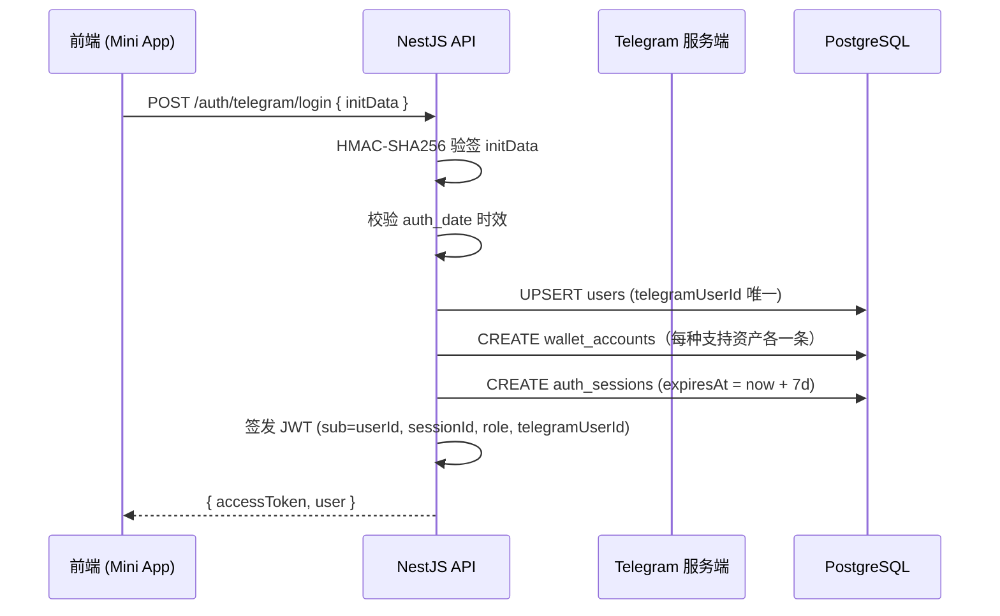
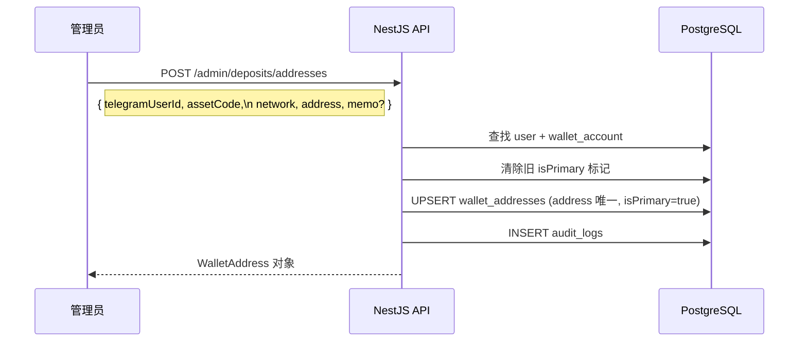
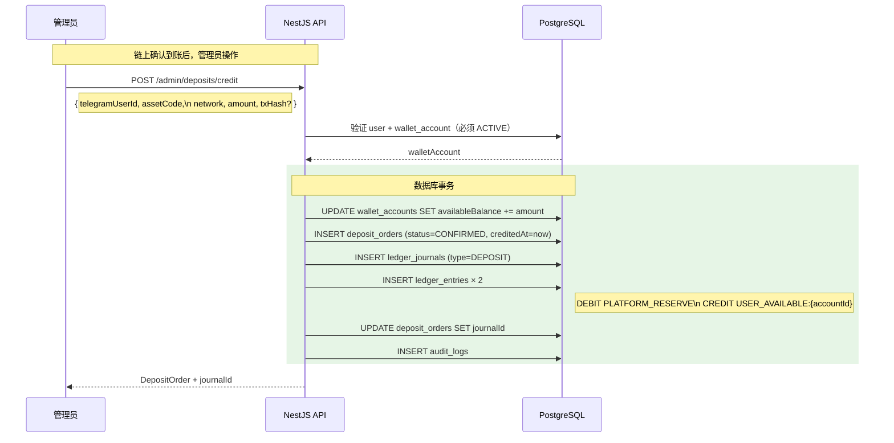
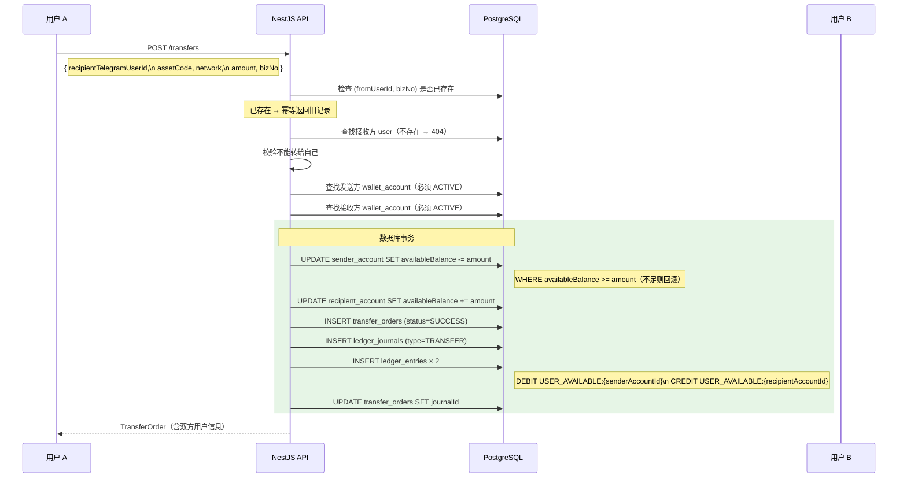
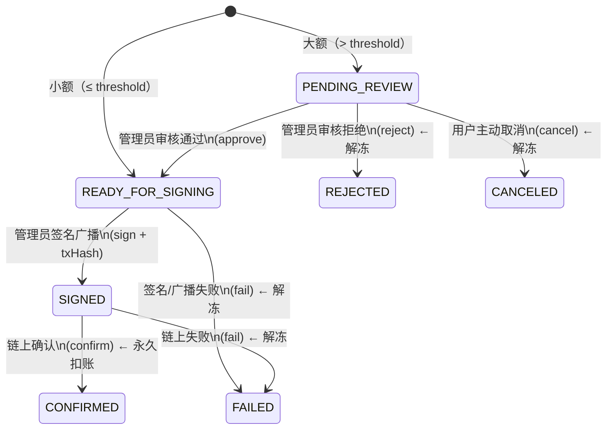
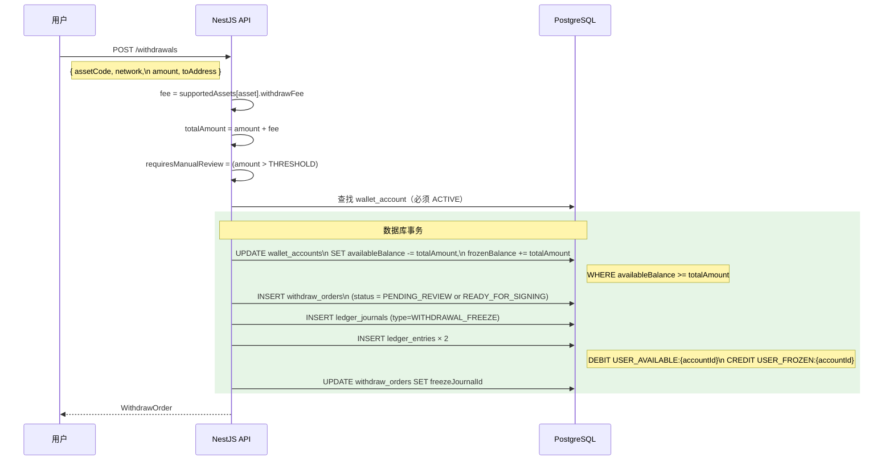
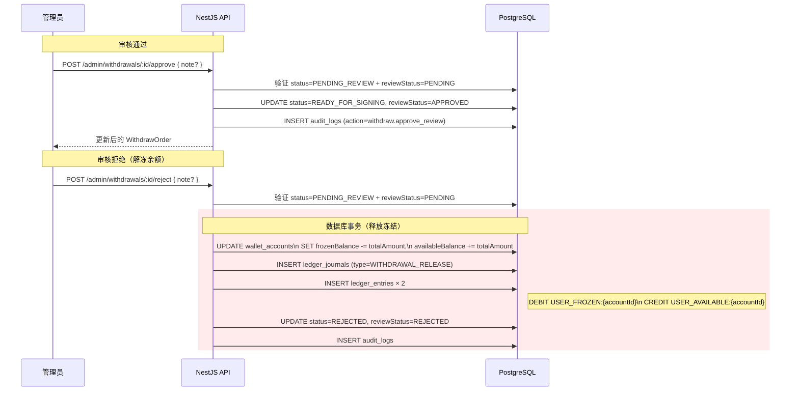
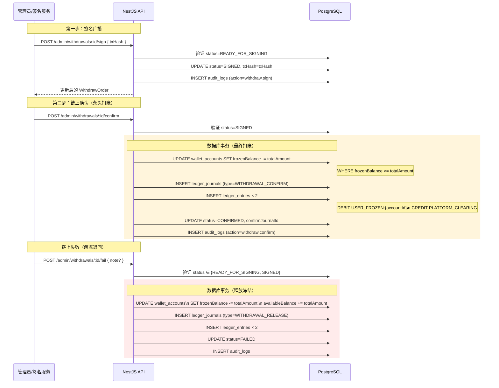
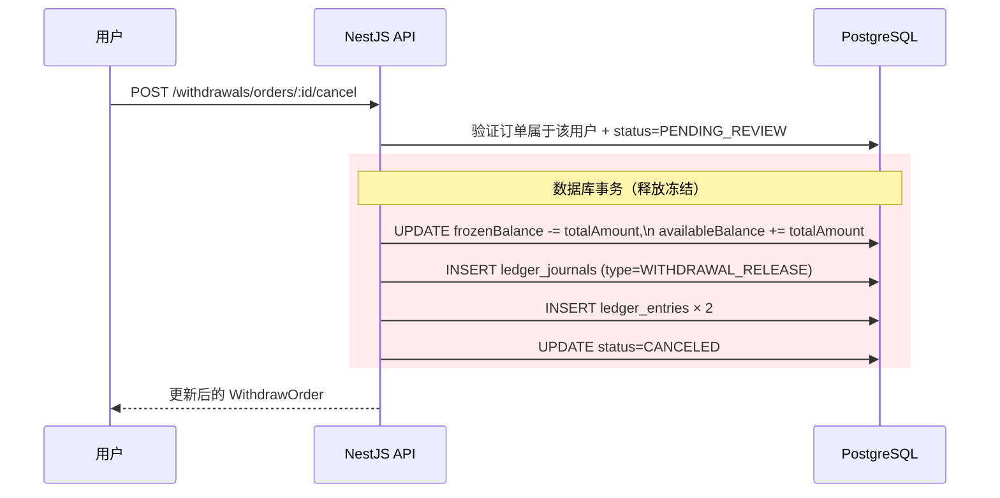
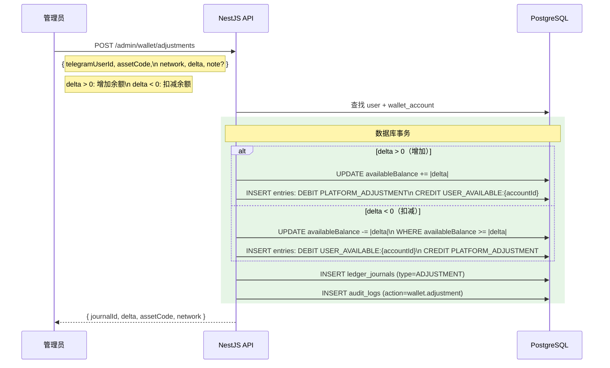

# 资金流转设计

## 账本双分录原则

每笔资金操作都生成一个 `LedgerJournal` + 两条 `LedgerEntry`（一借一贷）。  
- 借方（DEBIT）：资金流出的账户  
- 贷方（CREDIT）：资金流入的账户  

`WalletAccount.availableBalance` / `frozenBalance` 是**缓存字段**，由账本驱动更新，真实来源以 `LedgerEntry` 为准。

---

## 一、注册 / 登录



> 首次登录即注册，无需额外注册流程。  
> 若 `telegramUserId` 在 `ADMIN_TELEGRAM_IDS` 中，自动授予 ADMIN 角色。

---

## 二、充值（Deposit）

### 2.1 地址分配



用户查询充值地址：
```
GET /wallet/deposit-address?assetCode=TON&network=TON
→ { assetCode, network, address: "地址字符串 or null", memo }
```

### 2.2 充值入账（管理员手动确认，V1 替代链监听）



**账本分录（DEPOSIT）：**

| 方向 | 账户代码 | 金额 |
|---|---|---|
| DEBIT | `PLATFORM_RESERVE` | amount |
| CREDIT | `USER_AVAILABLE:{walletAccountId}` | amount |

---

## 三、站内转账（Transfer）



**账本分录（TRANSFER）：**

| 方向 | 账户代码 | 金额 |
|---|---|---|
| DEBIT | `USER_AVAILABLE:{senderAccountId}` | amount |
| CREDIT | `USER_AVAILABLE:{recipientAccountId}` | amount |

**幂等机制：** 客户端每次转账请求使用唯一 `bizNo`，网络重试时若服务端已处理则直接返回原订单，不重复扣款。

---

## 四、提现（Withdrawal）

### 4.1 提现状态机



### 4.2 创建提现（冻结余额）



**账本分录（WITHDRAWAL_FREEZE）：**

| 方向 | 账户代码 | 金额 |
|---|---|---|
| DEBIT | `USER_AVAILABLE:{walletAccountId}` | totalAmount |
| CREDIT | `USER_FROZEN:{walletAccountId}` | totalAmount |

### 4.3 审核阶段（大额提现）



### 4.4 签名与确认



**账本分录（WITHDRAWAL_CONFIRM）：**

| 方向 | 账户代码 | 金额 |
|---|---|---|
| DEBIT | `USER_FROZEN:{walletAccountId}` | totalAmount |
| CREDIT | `PLATFORM_CLEARING` | totalAmount |

**账本分录（WITHDRAWAL_RELEASE，拒绝/失败/取消）：**

| 方向 | 账户代码 | 金额 |
|---|---|---|
| DEBIT | `USER_FROZEN:{walletAccountId}` | totalAmount |
| CREDIT | `USER_AVAILABLE:{walletAccountId}` | totalAmount |

### 4.5 用户取消



---

## 五、管理员余额调整（Adjustment）

用于人工补账、修正余额等运营操作。



---

## 六、余额变动汇总

| 操作 | `availableBalance` | `frozenBalance` | JournalType |
|---|---|---|---|
| 充值入账 | ＋amount | 不变 | `DEPOSIT` |
| 站内转账（出） | −amount | 不变 | `TRANSFER` |
| 站内转账（入） | ＋amount | 不变 | `TRANSFER` |
| 创建提现 | −totalAmount | ＋totalAmount | `WITHDRAWAL_FREEZE` |
| 提现审核通过 | 不变 | 不变 | — |
| 提现拒绝/取消/失败 | ＋totalAmount | −totalAmount | `WITHDRAWAL_RELEASE` |
| 提现链上确认 | 不变 | −totalAmount | `WITHDRAWAL_CONFIRM` |
| 管理员增加余额 | ＋\|delta\| | 不变 | `ADJUSTMENT` |
| 管理员扣减余额 | −\|delta\| | 不变 | `ADJUSTMENT` |

> `totalAmount = amount + withdrawFee`
